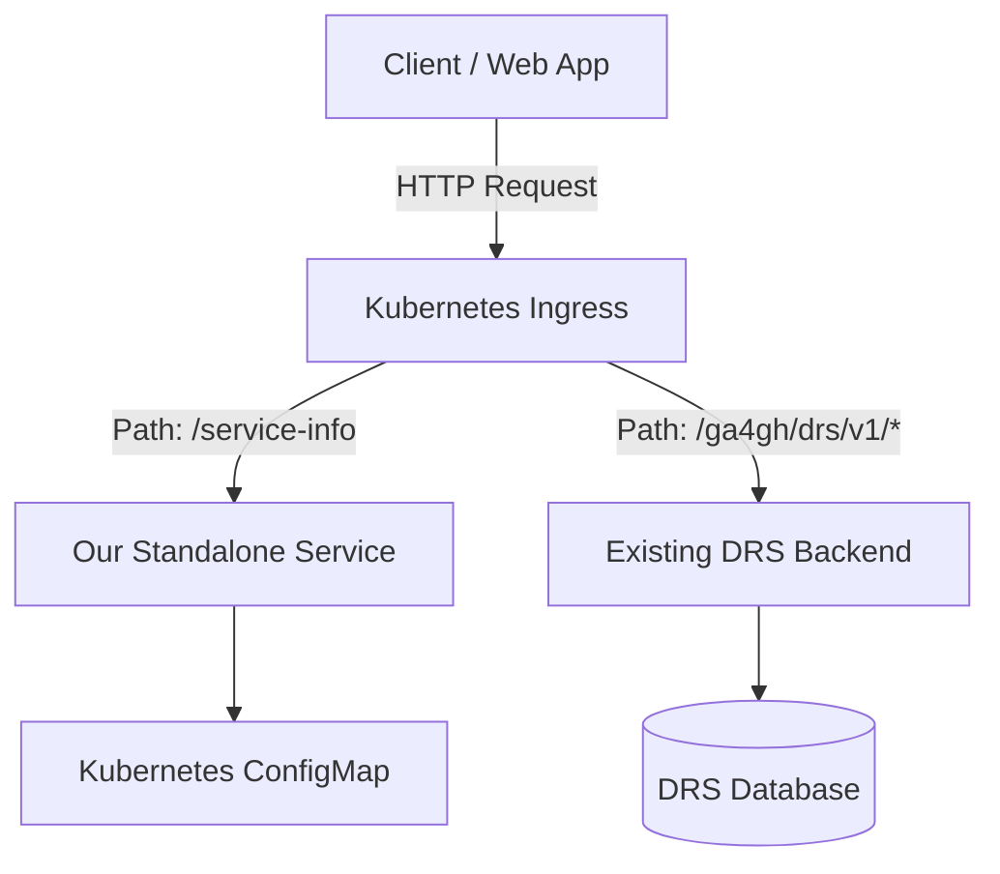

# GA4GH Service Info Standalone

A lightweight, cloud-native standalone Go microservice for standardizing and serving GA4GH `/service-info` metadata across implementations such as DRS, TES, WES, and TRS.

A standalone microservice maintained under the [Global Alliance for Genomics and Health (GA4GH)](https://www.ga4gh.org/).

---

## How It Works

The service runs as a **standalone Pod** alongside your genomics API (e.g. DRS/TES) in the same Kubernetes cluster. Your Ingress controller routes `/service-info` requests directly to this service, while routing all other API traffic to your main backend service. 



Metadata is managed via a Kubernetes `ConfigMap` mounted as a file. The service uses Go's `fsnotify` library to listen for changes to the ConfigMap directory and **hot-reloads** the configuration dynamically in memory without restarting the container.

---

## Features

- **Standard Compliance:** Validates required ServiceInfo fields (id, name, version, type, organization) when loading the YAML configuration.
- **Dynamic Hot-Reloading:** Refreshes metadata in real time when the mounted ConfigMap is updated (uses thread-safe `sync.RWMutex`).
- **Kubernetes Health Probes:** Exposes `/healthz` (liveness) and `/readyz` (readiness). The `/readyz` probe fails with `503 Service Unavailable` if the file watcher experiences a fatal system error (e.g., inotify descriptor exhaustion).
- **Graceful Shutdown:** Implements `context.Context` signals to intercept `SIGTERM` and shutdown the HTTP listener and background file watcher cleanly without dropping active requests.
- **CORS Support:** Exposes full Cross-Origin Resource Sharing (CORS) headers and handles preflight `OPTIONS` requests automatically, allowing web applications to easily query metadata.
- **Observability:** Exposes Prometheus metrics via `/metrics` (instruments request counts and latency histograms).

---

## Getting Started

### Local Development

1. **Clone the Repository:**
   ```bash
   git clone https://github.com/ga4gh/ga4gh_service_info_sidecar_gsoc_2026.git
   cd ga4gh_service_info_sidecar_gsoc_2026
   ```

2. **Run Local Server:**
   ```bash
   go run ./cmd/server
   ```
   *The server will start on port `8080` using a local dummy config path fallback.*

3. **Query Endpoints:**
   ```bash
   # ServiceInfo metadata
   curl -i http://localhost:8080/service-info

   # Prometheus Metrics
   curl -i http://localhost:9090/metrics

   # Kubernetes health probes
   curl -i http://localhost:8080/healthz
   curl -i http://localhost:8080/readyz
   ```

4. **Run Unit Tests:**
   ```bash
   go test ./... -v
   ```

5. **Run Tests (No Cache):**
   ```bash
   go test ./... -v -count=1
   ```

---

## Observability & Metrics

The `/metrics` endpoint exposes standard Go/Process metrics along with custom service HTTP metrics:

- `ga4gh_service_http_requests_total{path, method, status}`: Total number of requests processed.
- `ga4gh_service_http_request_duration_seconds{path, method}`: Histogram of request latencies.

Example Prometheus config scrape job snippet:
```yaml
scrape_configs:
  - job_name: 'ga4gh-service-info'
    static_configs:
      - targets: ['ga4gh-service-info.default.svc.cluster.local:9090']
```

---

## Production Deployment (Pre-built Image)

Pre-built Docker images are automatically published to the GitHub Container Registry (GHCR) on every merge to `main`. You do not need to build from source in production:
```bash
docker pull ghcr.io/gkbishnoi07/ga4gh_service_info_sidecar_gsoc_2026:latest
```

---

## Kubernetes Deployment (Minikube E2E Testing)

We provide standard Kubernetes manifests under `deploy/` for raw manifest deployments, and a Helm Chart under `deploy/helm/` for templated deployments.

### Option A: Raw Kubernetes Manifests

#### 1. Point local terminal to Minikube Docker registry
If testing in Minikube, configure your shell to build inside the Minikube virtual environment:
```bash
# PowerShell
minikube docker-env | Invoke-Expression

# Bash/Zsh
eval $(minikube docker-env)
```

#### 2. Build the Docker Image
Build the scratch-based image inside Minikube's Docker daemon:
```bash
docker build -t ga4gh-service-info:latest .
```

#### 3. Apply the Manifests
```bash
kubectl apply -f deploy/
```

#### 4. Verify deployment state
```bash
# Check pod is running and healthy
kubectl get pods -l app=ga4gh-service-info

# Expose port locally to verify endpoints
kubectl port-forward svc/ga4gh-service-info 8080:8080
```
Query `http://localhost:8080/service-info` to verify.

#### 5. Verify Hot-Reloading in-cluster
1. Edit the running configmap:
   ```bash
   kubectl edit configmap service-info-config
   ```
2. Change the `name` field value (e.g. from `"GA4GH Service Info"` to `"My Local Genomics Service"`).
3. Request `/service-info` again. Inside a few seconds, the service picks up the symlink swap and serves the updated field without any container restarts or dropped connections:
   ```bash
   curl http://localhost:8080/service-info
   ```

### Option B: Helm Chart (Recommended for Production)

The Helm Chart is located in `deploy/helm/ga4gh-service-info`.

#### 1. Install the Chart
Install the chart locally or from your values file:
```bash
helm install my-service ./deploy/helm/ga4gh-service-info
```

#### 2. Overriding Values on Deploy
You can dynamically customize any GA4GH metadata field, enable ingress, or modify replicas on deployment:
```bash
helm install my-service ./deploy/helm/ga4gh-service-info \
  --set serviceInfo.environment="production" \
  --set serviceInfo.organization.name="My Genome Center" \
  --set ingress.enabled=true
```

Refer to the Chart's `values.yaml` for a complete list of configurable variables.

### Ingress Integration
Review `deploy/ingress.yaml` for instructions on how to integrate the service path rule into your existing genomics service's Ingress.

---

## Related Specifications

- [GA4GH ServiceInfo Specification](https://github.com/ga4gh-discovery/ga4gh-service-info)
- [GA4GH DRS Specification](https://github.com/ga4gh/data-repository-service-schemas)
- [GA4GH TES Specification](https://github.com/ga4gh/task-execution-schemas)

---

## License

This project is licensed under the [Apache License 2.0](LICENSE).