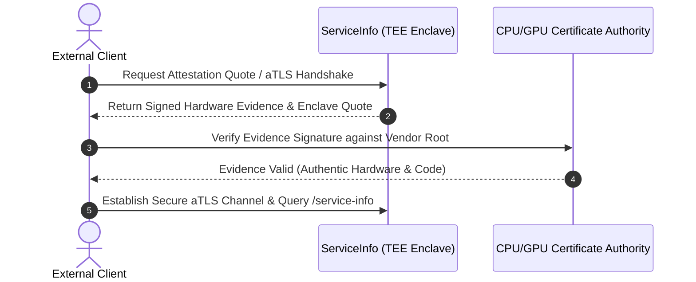

# Final report GSoC'26 project Ga4gh

  
  
  

This is the final report for my project that I've been working on during my summer of 2026 under the guidance of the mentors listed below.

### Project Details

*   **Student:** [Gopi Kishan](https://github.com/gkbishnoi07) ([LinkedIn](https://www.linkedin.com/in/gkbishnoi07/))
*   **Mentors:** [Pavel](https://www.linkedin.com/in/pavelnikonorov/), [Alex](https://www.linkedin.com/in/alexanderkanitz/), [Javed Habib](https://www.linkedin.com/in/javed-habib/)
*   **Organization:** [GA4GH](https://www.ga4gh.org/)
*   **Repository:** [ga4gh_service_info_sidecar_gsoc_2026](https://github.com/ga4gh/ga4gh_service_info_sidecar_gsoc_2026)

---

## About Me

I am Gopi Kishan, a 3rd-year computer science engineering student with a strong passion for open-source development, cloud-native architectures, and distributed systems. 

This GSoC 2026 project with GA4GH and ELIXIR marks my second successful [Google Summer of Code (GSoC)](https://summerofcode.withgoogle.com/) participation, having previously cracked **GSoC 2025** with the **[Mifos Initiative](https://github.com/openMF)** where I contributed to open-source financial inclusion software. In addition, I have contributed as a developer in **[Code for GovTech (C4GT)](https://pl-app.iiit.ac.in/c4gt/dmp2026)** with the **[Piramal Foundation (PSMRI)](https://github.com/PSMRI)**, working on citizen-centric civic technologies.

I love solving complex engineering challenges, from concurrency patterns to hardware-secured systems, and am dedicated to writing clean, production-grade code.

---

## 1. Project Overview & Core Mission

Every GA4GH-compliant service (such as DRS, WES, TES, or TRS) is required to expose a `/service-info` endpoint that returns structured metadata about the service instance. 

### The Problem
Traditionally, this metadata has been compiled directly into the application binaries or hardcoded in backend databases. This design makes metadata updates operationally complex: updating a simple contact URL or organization name required a full code review, binary rebuild, CI pipeline execution, and Pod restart. 

### The Solution: Decoupled Standalone Microservice
During GSoC 2026, I designed and built a lightweight, cloud-native standalone Go microservice that externalizes, validates, and serves standard-compliant `/service-info` metadata. Instead of coupling metadata with heavy application logic, the ServiceInfo service runs independently, allowing platform administrators to hot-reload metadata dynamically without any service interruption.

---

## 2. Core Service Architecture & Go Refactor

### Technical Implementation
*   **The Go Migration:** Ported the backend service from the initial Python prototype to Go to minimize resource utilization, achieve fast container startup times (<50ms), and decrease memory usage down to ~15MB.
*   **Decoupled Architecture:** Re-engineered the service from a shared-pod sidecar model (requiring container configuration sharing) into a standalone microservice routed externally via Ingress rules. This completely decoupled the service lifecycle and reduced the blast radius of metadata server crashes.

### Related Pull Requests
*   **[PR #2: Basic GA4GH ServiceInfo Endpoint](https://github.com/ga4gh/ga4gh_service_info_sidecar_gsoc_2026/pull/2)** — Implemented the initial REST endpoint prototype serving static GA4GH metadata.
*   **[PR #14: Python to Go Rewrite](https://github.com/ga4gh/ga4gh_service_info_sidecar_gsoc_2026/pull/14)** — Rewrote the service codebase in Go to improve performance and compatibility with scratch container builds.
*   **[PR #22: Rebrand Sidecar to Standalone](https://github.com/ga4gh/ga4gh_service_info_sidecar_gsoc_2026/pull/22)** — Architected the microservice to run as an independent, Ingress-routed standalone service.

---

## 3. Concurrency-Safe Hot-Reloading & Validation

### Technical Implementation
*   **Directory Watching via `fsnotify`:** Configured the watcher to monitor the containing directory rather than the file itself. This is required because Kubernetes updates ConfigMaps by performing an atomic symlink swap (`..data`), which alters directory references rather than updating the file inode directly.
*   **Thread Safety:** Handled configuration access concurrently using a `sync.RWMutex`. HTTP handlers acquire a read lock (`RLock`), while the hot-reloader goroutine acquires a write lock (`Lock`) to swap the configuration pointer in memory.
*   **Schema Validation:** Implemented structural checks verifying mandatory fields (`id`, `name`, `version`, `type.*`, `organization.*`) are present. Invalid configurations trigger logs and are rejected, preserving the previous configuration state without crashing.

### Related Pull Requests
*   **[PR #12: Reverse Proxy Deep Merge](https://github.com/ga4gh/ga4gh_service_info_sidecar_gsoc_2026/pull/12)** — Explored the initial deep merge prototype for configuration properties.
*   **[PR #17: Config Hot-Reload via fsnotify](https://github.com/ga4gh/ga4gh_service_info_sidecar_gsoc_2026/pull/17)** — Built the synchronized hot-reload engine and folder watch loops.

---

## 4. CORS, Observability, & Containerization

### Technical Implementation
*   **Observability Middlewares:** Integrated Prometheus metrics middleware, exposing request counts and latency histograms (`ga4gh_service_http_requests_total`, `ga4gh_service_http_request_duration_seconds`) on an independent metrics port.
*   **CORS & Clean Shutdowns:** Enabled full CORS headers to support queries from browser-based web portals and added OS signal listeners to intercept `SIGTERM`/`SIGINT` for clean socket closures.
*   **Distroless Containerization:** Built multi-stage Dockerfiles utilizing a `scratch` base image to deploy minimal, secure, and distroless runtime containers (<20MB total footprint).

### Related Pull Requests
*   **[PR #19: Docker Containerization](https://github.com/ga4gh/ga4gh_service_info_sidecar_gsoc_2026/pull/19)** — Added Docker support and optimized container image multi-stage compilation.
*   **[PR #20: CORS, Metrics, and Timeouts](https://github.com/ga4gh/ga4gh_service_info_sidecar_gsoc_2026/pull/20)** — Implemented cross-origin resource sharing, server timeouts, and Prometheus scraping middlewares.

---

## 5. Kubernetes & Cloud-Native Deployment

### Technical Implementation
*   **Raw Manifests & Ingress:** Provided standard deployment manifests alongside Ingress path rules that isolate `/service-info` routes from the rest of the genomics API traffic.
*   **Helm Charts:** Designed a structured Helm Chart with configurable values, enabling deployment configuration overrides for organizations, environments, and server ports.

### Related Pull Requests
*   **[PR #21: Kubernetes Manifests & Standalone Docs](https://github.com/ga4gh/ga4gh_service_info_sidecar_gsoc_2026/pull/21)** — Created base manifests for services, deployments, configmaps, and routing.
*   **[PR #25: Capitalization Manifest Fixes](https://github.com/ga4gh/ga4gh_service_info_sidecar_gsoc_2026/pull/25)** & **[PR #26: Typos Corrections](https://github.com/ga4gh/ga4gh_service_info_sidecar_gsoc_2026/pull/26)** — Cleaned up Kubernetes YAML specifications.
*   **[PR #28: Helm Chart for Kubernetes](https://github.com/ga4gh/ga4gh_service_info_sidecar_gsoc_2026/pull/28)** — Built and structured Helm charts for templated packaging.

---

## 6. Testing Strategy & Continuous Integration

### Technical Implementation
*   **E2E Integration Testing:** Developed HTTP client integration tests that dynamically allocate free loopback ports (`:0`) to eliminate port collisions during concurrent test execution.
*   **Polled Assertions:** Replaced static, flaky test delays (`time.Sleep`) with poll-based loops checking state change conditions within a 2-second timeout.
*   **CI/CD Automation:** Set up GitHub Actions workflows checking compilation, vet, and lint guidelines (`golangci-lint`), and automated Docker image packaging to the GitHub Container Registry (GHCR) on merge.

### Related Pull Requests
*   **[PR #1: CI/CD Setup](https://github.com/ga4gh/ga4gh_service_info_sidecar_gsoc_2026/pull/1)** — Standardized initial module structure and basic workflow runs.
*   **[PR #23: Docker Builds, E2E, and Lint](https://github.com/ga4gh/ga4gh_service_info_sidecar_gsoc_2026/pull/23)** — Automated validation pipelines for pull requests.
*   **[PR #29: GHCR Docker Publish Workflow](https://github.com/ga4gh/ga4gh_service_info_sidecar_gsoc_2026/pull/29)** — Enabled automated image building and pushes to GHCR on merge to main.
*   **[PR #32: Comprehensive Unit and E2E Tests](https://github.com/ga4gh/ga4gh_service_info_sidecar_gsoc_2026/pull/32)** — Implemented robust, race-safe unit and integration test suites.

---

## 7. Documentation & Diagram Migrations

### Technical Implementation
*   **Guide Overhaul:** Reorganized user guides, quickstart manifests, and configuration documentation.
*   **Mermaid Migrations:** Migrated static text-based ASCII flowcharts into high-fidelity, interactive Mermaid graphs. Cleaned up HTML elements inside Mermaid code blocks to ensure compatibility with MkDocs rendering engines.

### Related Pull Requests
*   **[PR #4: Community Guidelines](https://github.com/ga4gh/ga4gh_service_info_sidecar_gsoc_2026/pull/4)** — Set up codebase CONTRIBUTING and CODE_OF_CONDUCT templates.
*   **[PR #6: MkDocs Setup & Pages Deploy](https://github.com/ga4gh/ga4gh_service_info_sidecar_gsoc_2026/pull/6)** — Initialized documentation skeleton and GitHub Pages deployment configuration.
*   **[PR #10: API Reference Page](https://github.com/ga4gh/ga4gh_service_info_sidecar_gsoc_2026/pull/10)** — Configured mkdocstrings API catalog structures.
*   **[PR #13: Architecture Guide](https://github.com/ga4gh/ga4gh_service_info_sidecar_gsoc_2026/pull/13)** — Wrote technical architecture, endpoints, and data routing manuals.
*   **[PR #24: Architecture Diagrams](https://github.com/ga4gh/ga4gh_service_info_sidecar_gsoc_2026/pull/24)** — Created visual reference architectures.
*   **[PR #31: Helm and GHCR Details](https://github.com/ga4gh/ga4gh_service_info_sidecar_gsoc_2026/pull/31)** — Documented image retrieval and Helm chart configurations.
*   **[PR #33: Restructure Guides & Fix Contributing](https://github.com/ga4gh/ga4gh_service_info_sidecar_gsoc_2026/pull/33)** — Rewrote guide categories and updated testing requirements.
*   **[PR #34: Mermaid Index Diagram Fix](https://github.com/ga4gh/ga4gh_service_info_sidecar_gsoc_2026/pull/34)** & **[PR #35: Mermaid Folder Trees & Headers Cleanup](https://github.com/ga4gh/ga4gh_service_info_sidecar_gsoc_2026/pull/35)** — Restored index page layout, migrated folder trees to Mermaid, and removed decorative emojis.

---

## 8. Pull Request Reference Table

The table below records all pull requests completed during the GSoC 2026 lifecycle:

| PR # | Type | Description |
| :--- | :--- | :--- |
| **[#1](https://github.com/ga4gh/ga4gh_service_info_sidecar_gsoc_2026/pull/1)** | `chore` | Initialized Git repository structure and basic actions pipelines. |
| **[#2](https://github.com/ga4gh/ga4gh_service_info_sidecar_gsoc_2026/pull/2)** | `feat` | Programmed the initial ServiceInfo Go struct mapping. |
| **[#4](https://github.com/ga4gh/ga4gh_service_info_sidecar_gsoc_2026/pull/4)** | `chore` | Set up issue templates, Contributing rules, and Code of Conduct. |
| **[#6](https://github.com/ga4gh/ga4gh_service_info_sidecar_gsoc_2026/pull/6)** | `docs` | Initialized MkDocs styling configurations and automation workflows. |
| **[#10](https://github.com/ga4gh/ga4gh_service_info_sidecar_gsoc_2026/pull/10)** | `docs` | Configured auto-generating API schema descriptions. |
| **[#12](https://github.com/ga4gh/ga4gh_service_info_sidecar_gsoc_2026/pull/12)** | `feat` | Developed the proxy deep merge config logic. |
| **[#13](https://github.com/ga4gh/ga4gh_service_info_sidecar_gsoc_2026/pull/13)** | `docs` | Drafted initial technical architecture documentation. |
| **[#14](https://github.com/ga4gh/ga4gh_service_info_sidecar_gsoc_2026/pull/14)** | `refactor` | Rewrote core service from Python to Go. |
| **[#17](https://github.com/ga4gh/ga4gh_service_info_sidecar_gsoc_2026/pull/17)** | `feat` | Programmed Hot-Reloading using directory-based fsnotify checks. |
| **[#19](https://github.com/ga4gh/ga4gh_service_info_sidecar_gsoc_2026/pull/19)** | `feat` | Set up Docker container builds. |
| **[#20](https://github.com/ga4gh/ga4gh_service_info_sidecar_gsoc_2026/pull/20)** | `feat` | Added observability endpoints, Prometheus tracking, and CORS support. |
| **[#21](https://github.com/ga4gh/ga4gh_service_info_sidecar_gsoc_2026/pull/21)** | `feat` | Created initial raw Kubernetes manifests and standalone routing docs. |
| **[#22](https://github.com/ga4gh/ga4gh_service_info_sidecar_gsoc_2026/pull/22)** | `refactor` | Replaced sidecar layout in code and configuration with standalone microservice logic. |
| **[#23](https://github.com/ga4gh/ga4gh_service_info_sidecar_gsoc_2026/pull/23)** | `ci` | Standardized pull request quality pipelines (build/test/lint). |
| **[#24](https://github.com/ga4gh/ga4gh_service_info_sidecar_gsoc_2026/pull/24)** | `docs` | Added high-level diagrams and corrected text typos. |
| **[#25](https://github.com/ga4gh/ga4gh_service_info_sidecar_gsoc_2026/pull/25)** | `fix` | Cleared minor key capitalization errors in manifests. |
| **[#26](https://github.com/ga4gh/ga4gh_service_info_sidecar_gsoc_2026/pull/26)** | `fix` | Corrected minor formatting issues in deployment templates. |
| **[#28](https://github.com/ga4gh/ga4gh_service_info_sidecar_gsoc_2026/pull/28)** | `feat` | Developed the templated Helm Chart for Kubernetes. |
| **[#29](https://github.com/ga4gh/ga4gh_service_info_sidecar_gsoc_2026/pull/29)** | `ci` | Added publishing automation for built container images to GHCR. |
| **[#31](https://github.com/ga4gh/ga4gh_service_info_sidecar_gsoc_2026/pull/31)** | `docs` | Documented Helm deployments and GHCR image tags. |
| **[#32](https://github.com/ga4gh/ga4gh_service_info_sidecar_gsoc_2026/pull/32)** | `feat` | Added robust unit and E2E integration test suites with polling. |
| **[#33](https://github.com/ga4gh/ga4gh_service_info_sidecar_gsoc_2026/pull/33)** | `docs` | Overhauled user guides, quickstart paths, and contributing rules. |
| **[#34](https://github.com/ga4gh/ga4gh_service_info_sidecar_gsoc_2026/pull/34)** | `docs` | Converted documentation index layout to standard Mermaid flowchart. |
| **[#35](https://github.com/ga4gh/ga4gh_service_info_sidecar_gsoc_2026/pull/35)** | `docs` | Migrated folder layouts to Mermaid graphs and removed heading emojis. |

---

## 9. The Next Horizon: Attested-TLS (aTLS) & Confidential Computing

In collaboration with my mentors, the next phase of this project extends the ServiceInfo microservice to support **Confidential Computing** in federated clouds (such as the ELIXIR Cloud federation).

### The Objective
Establish hardware-level trust for GA4GH metadata endpoints. Instead of simply trusting the server domain, clients must be able to verify that the service is running inside a secure, untampered **Trusted Execution Environment (TEE)** (using Intel SGX or AMD SEV).

### Future Work Scope
*   **aTLS Integration:** Integrate the Attested-TLS protocol into the ServiceInfo Go codebase. During the TLS handshake, the service will supply CPU-signed evidence verifying memory isolation and software integrity.
*   **Client Verification Interface:** Implement client-side verification tools for other GA4GH services (like TESK or WES) to automatically validate remote service enclaves using vendor certificates.

---

## Acknowledgments & Future Commitment

I would like to express my deepest gratitude to my mentors, **Pavel** and **Alex** for their guidance, detailed code reviews, and support throughout the summer of 2026. This opportunity has been an invaluable learning experience in building high-quality, production-grade cloud-native software.

Although the formal Google Summer of Code period is ending, **I am committed to continuing my contributions to this project and the broader GA4GH/ELIXIR ecosystem**. I look forward to collaborating on the upcoming Attested-TLS (aTLS) integration and helping build the next generation of secure, confidential genomics infrastructure.

*Thank you for this incredible journey!*
